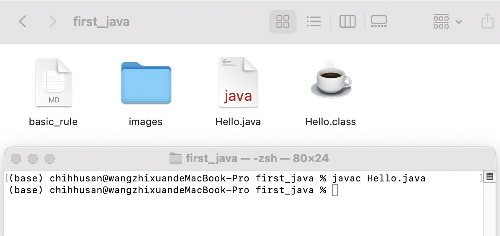
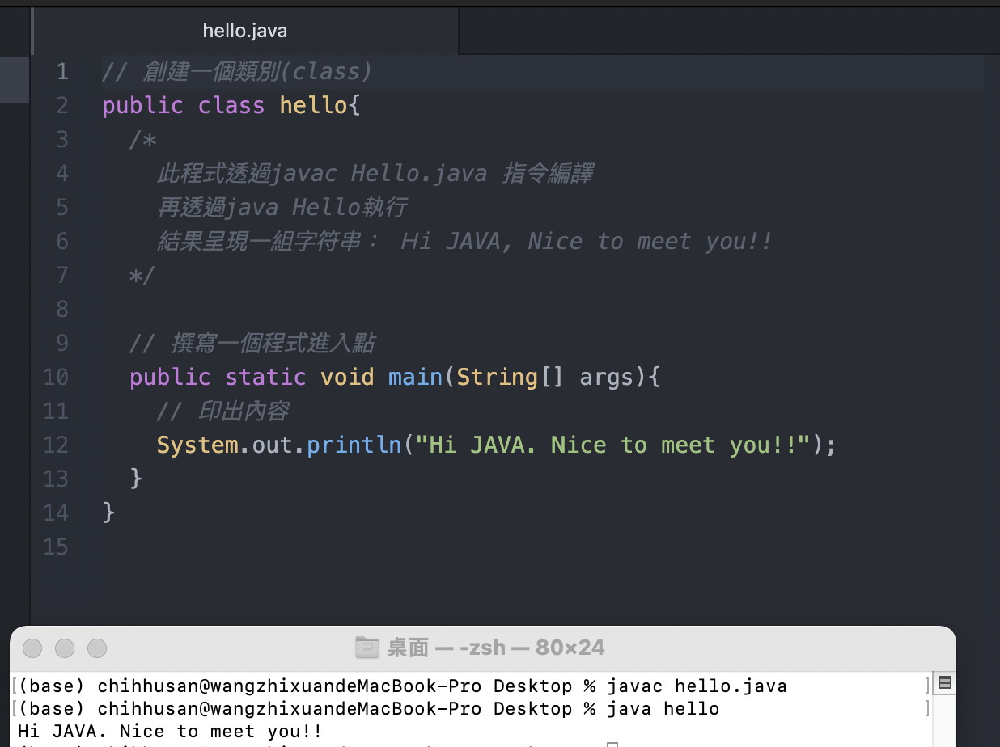

# Java學習筆記 - 進入Java的第一支程式 - 從一支小程式講解Java的基本規則


大家新年快樂！！今天我們不講Python，由於小弟我最近在學習Java，所以接下來也會有一系列關於Java的學習文章，希望對Java有興趣的朋友們可以一起學習啦XD，如果有哪裡有問題或寫錯的地方，都希望大家能夠不吝嗇告訴我了，感謝！！


## 一. 撰寫我們的第一支Java程式

### Step 1: 定義類別

```java
public class Hello{}
```

**解釋:**

+ public: 代表我們將這個方法設定為公開的，也就是外部可以呼叫使用，反之就會使用private
+ class: 創建類別(Class)

 ### Step 2: 撰寫程式的進入點

**注意: 當JVM在執行我們的程式碼時，首先會尋找程式的進入點，而JVM定義(認定)的進入點為main()，而且規定一定要寫成public static void main(String[] args)**

```java
public static void main(String[] args){
}
```

**解釋:**

+ static: 宣告為靜態的方法，表示程式在執行之前，就需要把裡面的內容載入記憶體中

**注意: 記憶體一定要有我們的主程式，我們的程式碼才會執行，所以主程式一定為靜態的**

+ void: 字面上的解釋為空，代表宣告我們返回的為空，也就是不返回任何東西

**注意: Java中一定要定義方法返回的型態，所以不能不寫東西，而我們不想返回東西，也就代表返回的為空，所以常常會使用void來表示不返回任何東西**

+ main: 是JVM定義的程式進入點名稱，所以不能任由我們更改，要照著寫
+ String[] args: 表示main這個程式進入點接受字串陣列(String[])當作參數，這也是被JVM定義好的，所以不能任意更改，args表示這個字串陣列(String[])的變數名稱，可以由我們自行決定更改，ex. main(String[] hello)

### Step 3: 印出字符串

```java
System.out.println("Hi JAVA. Nice to meet you!!");
```

**注意: 在Java程式中會嚴格規定使用`;`，來表示此行程式敘述完成**

這個在Python中就沒有規定要加`;`號，直接使用空行程式就知道這行的敘述已經完成了


**p.s. 這邊我想分享一個我遇到的問題XD，我在println中使用的是`''`來包住我要印出的字串，但是報錯了！！這邊有嚴格規定一定要使用`""`來包住要印出的字符串**


### 完整程式碼

```java
// 創建一個類別(class)
public class Hello{
  /*
    透過javac Hello.java的指令編譯
    接著透過java Hello來執行
    執行結果： Hi JAVA. Nice to meet you!!
  */
  // 撰寫一個程式進入點
  public static void main(String[] args){
    // 印出內容
    System.out.printIn("Hi JAVA. Nice to meet you!!");
  }
}
```


## 二. 如何執行Java？

### Step 1: 編譯我們寫好的Java檔

指令

> javac (我們的Java檔).java
>

ex. 

```
(base) chihhusan@wangzhixuandeMacBook-Pro Desktop % javac Hello.java
```

**執行結果**: 會產生一個編譯好的.class檔




### Step 2: 執行Java檔

指令

> java (編譯好的.class檔)

注意：這邊不需要把副檔名.class寫上喔

**執行結果**

Ex.

```
(base) chihhusan@wangzhixuandeMacBook-Pro first_java % javac Hello.java
(base) chihhusan@wangzhixuandeMacBook-Pro first_java % java Hello
Hi JAVA. Nice to meet you!!
```


## 三. Java撰寫規則

### 規則一： 檔名需要與檔案內容中的Class Name(類別名稱)相同

遇到錯誤：我嘗試將檔名跟檔案裡面的class(類別)名稱不同，編譯的時候就報錯了！！

```java
(base) chihhusan@wangzhixuandeMacBook-Pro Desktop % javac test.java 
test.java:2: error: class Hello is public, should be declared in a file named Hello.java
public class Hello{
```

### 規則二： 一個Java必須至少有一個Class(類別)

### **規則三：一般來說會把Ｃlass名稱的第一個字寫成大寫(非必須)**

我這邊嘗試將類別名稱寫小寫，然後重新編譯跟執行，還是能夠執行




### 規則四: 使用println印出字符串要使用“ ”來包住，使用' '會報錯

這邊我故意將程式改寫成System.out.println(‘Hi JAVA. Nice to meet you!!’);

執行的時候就會報錯

```
(base) chihhusan@wangzhixuandeMacBook-Pro first_java % javac Hello.java
Hello.java:11: error: illegal character: '\u2018'
    System.out.println(‘Hi JAVA. Nice to meet you!!’);
                       ^
Hello.java:11: error: ';' expected
    System.out.println(‘Hi JAVA. Nice to meet you!!’);
                               ^
Hello.java:11: error: ';' expected
    System.out.println(‘Hi JAVA. Nice to meet you!!’);
                                        ^
Hello.java:11: error: ';' expected
    System.out.println(‘Hi JAVA. Nice to meet you!!’);
                                                 ^
Hello.java:11: error: illegal character: '\u2019'
    System.out.println(‘Hi JAVA. Nice to meet you!!’);
                                                   ^
5 errors
```


### 規則五 - 使用//和/* */來進行單行與多行註解

努力寫註解是一個寫程式的好習慣，所以我們也要快速瞭解Java是怎麼註解的，程式會自動忽略掉我們註解的部分，所以大家不用擔心註解會影響程式


單行註解: 當我們註解的內容只有一行的時候，使用`//`

```java
// 創建一個類別(class)
```


多行註解: 當我們需要將好幾行同時註解`/* /*`

```java
 /*
   透過javac Hello.java的指令編譯
   接著透過java Hello來執行
   執行結果： Hi JAVA. Nice to meet you!!
 */
```


